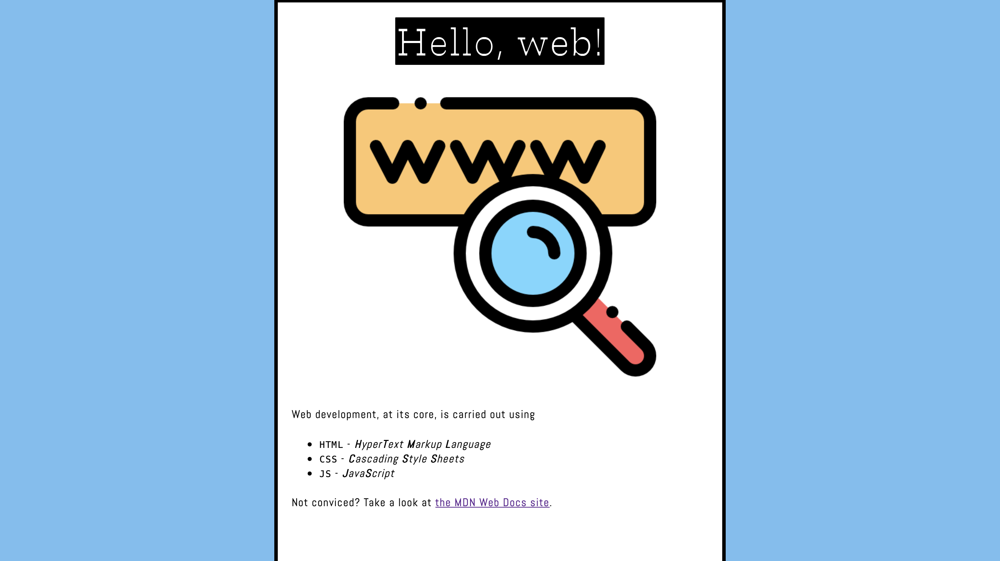
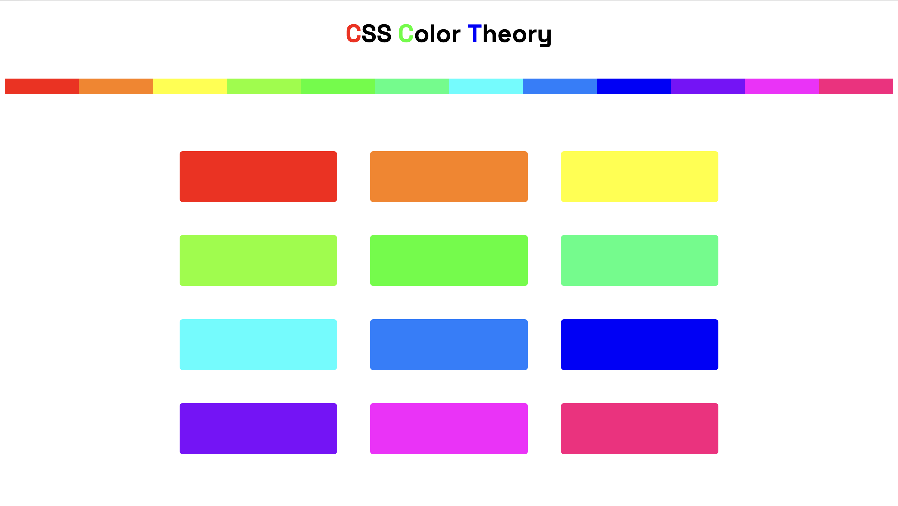
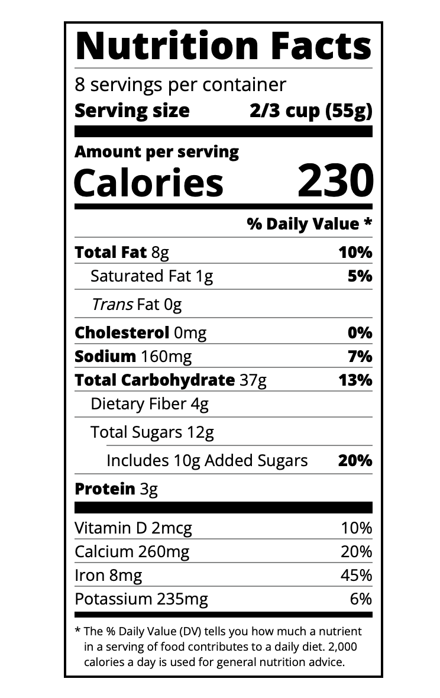
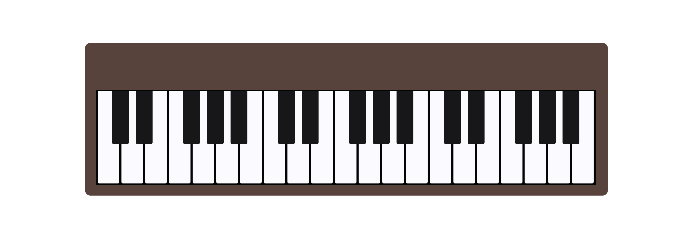
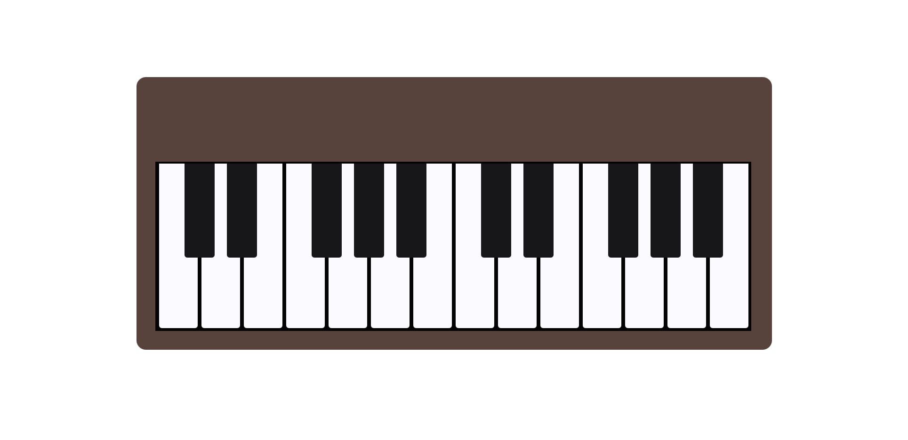
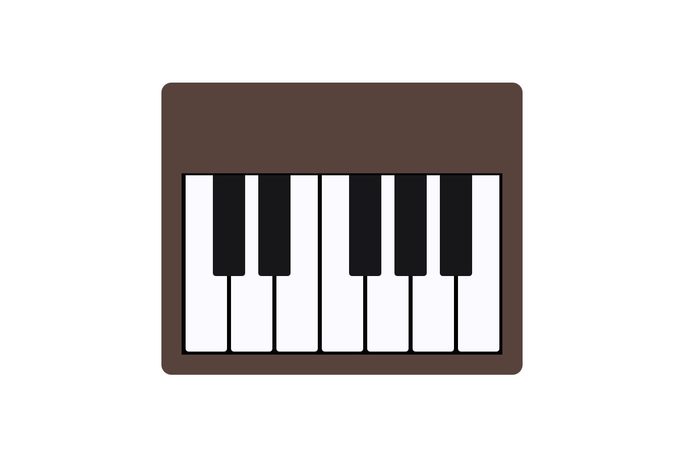
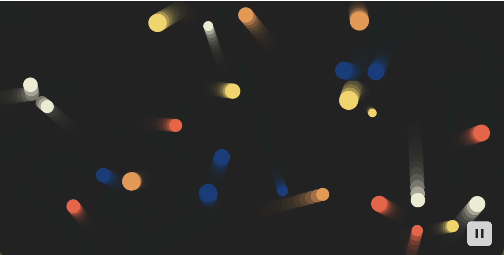
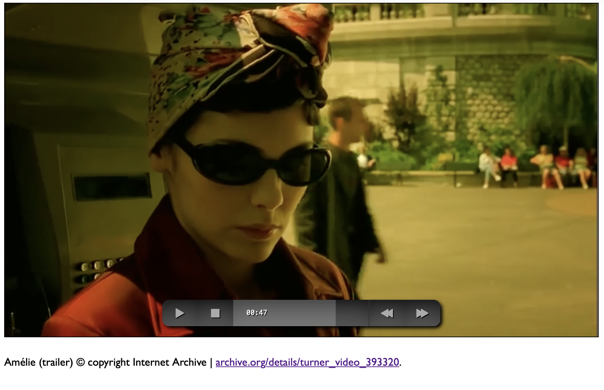

# basic-web

Basic (and **not** so basic) examples of the `HTML` and `CSS` languages.
Modified from these tutorials:
- [x] [MDN](https://developer.mozilla.org/en-US/docs/Learn/)
- [x] [W3Schools](https://www.w3schools.com/)
- [ ] [Codecademy](https://www.codecademy.com/catalog/language/html-css)
- [x] [freeCodeCamp](https://www.freecodecamp.org/learn/responsive-web-design/)
- [ ] [After Hours Programming](https://www.afterhoursprogramming.com/)

and others...

## Structure

### How to use this repository

Open any of the project folders directly in a browser and review the HTML, CSS, and JavaScript files to see how each example is built.

#### `intro/`
A starting point example that demonstrates a simple landing-page style structure.

  

#### `colors/`
A visual exercise focused on color palettes and layout styling using both, CSS Flexbox and Grid.

  

#### `nutrition-label-us/`
A recreation of a nutrition label layout using HTML and CSS.

    

#### `piano/`
A keyboard-style interface experiment built with HTML and CSS. Applies media queries to vary the size of the keyboard.

    
    
    

#### `bouncing-balls/`
A simple physics-inspired interaction demo built with the Matter.js library.

    

#### `custom-video-player/`
A custom media player with styled controls and interactive behavior.

  

